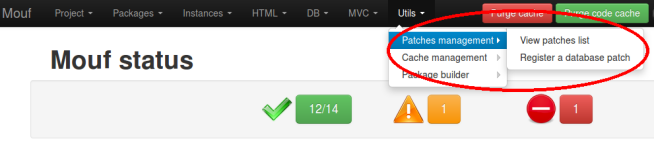
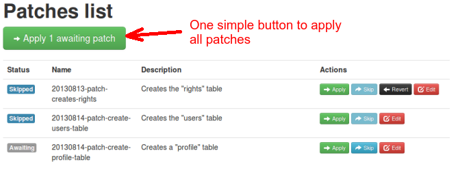
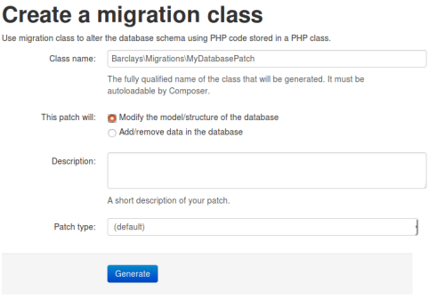

[](https://packagist.org/packages/mouf/utils.patcher)
[](https://packagist.org/packages/mouf/utils.patcher)
[](https://packagist.org/packages/mouf/utils.patcher)
[](https://scrutinizer-ci.com/g/thecodingmachine/utils.patcher/?branch=1.0)

Mouf's patching system
======================

This package is a patch system designed for [Mouf](http://mouf-php.com) than enables developers to know what patch has been run and what needs to be run on its environment.
If you are working with a team or with many environment, this is very useful to know which database patches have been applied or not in an environment.

Video tutorial
--------------

<iframe width="640" height="480" src="//www.youtube.com/embed/1uxO1qDSuZw" frameborder="0" allowfullscreen></iframe>

Installing the patch service
----------------------------

Installation is done via [composer](http://getcomposer.com). Here is a typical _composer.json_ file:


```json
{
	...
    "require": {
        "mouf/utils.patcher": "~2.0",
        "mouf/database.patcher": "~2.3"
    } 
}
```
As you can see, we are installing two packages here.

- **mouf/utils.patcher** contains the patch service. The patch service can be used to install any kinds of patches, but does not contain any patches implementation. This is why we need the second packages.
- **mouf/database.patcher** adds an easy way to create database patches (the most common use of the patch system).

Using the patch service (graphical user interface)
--------------------------------------------------

Once the patch service is installed, you will notice there is a new menu in Mouf UI.



Using the **Utils** > **Patches management** menu, you can access the patches list or create new database patches.

Let's have a quick look at the paches list.



In this list, you can view all the patches that have been defined. Using one big button, you can easily apply all the patches
that needs to be applied. This is really the only button you should ever touch on that screen, unless you are playing with advanced
features like database replication, etc...

If you need a more *fine-tuned* approach, you can **apply** each patch one by one. You can also 
**skip** the patch if you prefer to run it yourself or if you know it has already been applied.
Finally, you will notice that some patches can be **reverted**.

Using the patch service (command line interface)
------------------------------------------------

You can also apply patches using the Mouf console. This is especially useful for deployments in continuous integration environments or on a production server.

```sh
$ # Apply all default patches
$ vendor/bin/mouf_console patches:apply-all
$
$ # Apply all patches from type default AND test_data
$ vendor/bin/mouf_console patches:apply-all --test-data
$
$ # View a list of all patches
$ vendor/bin/mouf_console patches:list
$
$ # Apply one specific patch by name
$ vendor/bin/mouf_console patches:apply [patch_name]
$
$ # Revert one specific patch by name
$ vendor/bin/mouf_console patches:revert [patch_name]
```


Creating/Editing a database patch
---------------------------------

You have 2 options to edit your database patches.

- Option 1: generate a SQL patch (you use SQL to alter your database)
- Option 2: generate a migration PHP class (you use PHP class to alter your database)

### Using SQL patches

You can create a new SQL database patch using the **Utils** > **Patches management** > **Register a SQL patch** menu.


As you can see, you need to provide a unique patch name. You can (and you should) add a comment that will help
you and others remember what this patch is doing.
Finally, you will add the SQL of the patch.

You can choose what to do when you save the patch. You have 3 options:

- Most often, it is likely than when you save the patch, you already applied it in your development environment.
In this case, you should **skip** the patch (there is no point in applying this patch again).
- If you haven't applied the patch yet, you can choose to save and **apply** the patch.
- Finally, you can also choose to save, but **do not apply** the patch yet. In this case, the patch will be in **Awating** state. 
 
#### Advanced options

There are a number of advanced options. These will allow you to:

- Choose the file saving the patch (the SQL of the patch is stored in its own file, usually in the **database/up** directory.
- Set up a *reverse patch* that can be used to cancel/revert your patch.

### Using PHP migration classes

You can create a new PHP migration class using the **Utils** > **Patches management** > **Register a SQL patch** menu.



There are really 2 kinds of migration patches:

- the patches that edit your database model
- the patches that edit your data

You should choose which kind of patch you are creating in the UI.

The UI will generate a PHP file for you containing your class.

You can then use the power of Doctrine DBAL to write your patch.

**Class generated for altering a database model**
```php
// The class will be generated by the patch system
class MyPatch extends AbstractSchemaMigrationPatch
{
    public function up(Schema $schema) : void
    {
        // Use the "up" function to alter the database model.
        // The $schema object documentation can be found in Doctrine DBAL documentation:
        //   http://docs.doctrine-project.org/projects/doctrine-dbal/en/latest/reference/schema-representation.html
        
        // For instance:
        $table = $schema->createTable('posts');
        $table->addColumn('id', 'integer');
        $table->addColumn('description', 'string');
        $table->setPrimaryKey(['id']);
    }
    
    public function down(Schema $schema) : void
    {
        // Code your migration cancellation code here.
    }
    
    public function getDescription(): string
    {
        return 'The comment for your patch (displayed in the Mouf patch list or in the CLI command)';
    }
}
```

**Class generated for altering data**
```php
// The class will be generated by the patch system
class MyPatch extends AbstractDataMigrationPatch
{
    public function up(Connection $connection) : void
    {
        // Use the "up" function to alter the data.
        // The $connection object documentation can be found in Doctrine DBAL documentation:
        //   http://docs.doctrine-project.org/projects/doctrine-dbal/en/latest/reference/data-retrieval-and-manipulation.html
        
        // For instance:
        $connection->insert('posts', [
            'id' => 1,
            'description' => 'foobar'
        ]);
    }
    
    public function down(Connection $connection) : void
    {
        // Code your migration cancellation code here.
    }
    
    public function getDescription(): string
    {
        return 'The comment for your patch (displayed in the Mouf patch list or in the CLI command)';
    }
}
```

### Patch type

Whether you create a SQL patch or a PHP migration class, you can select a patch "type".

By default, the package comes with 2 bundled types:

- *default*: for patches that should always be applied (like patches modifying the database model)
- *test_data*: for patches that should be applied conditionnally based on the environment (you might want test data in your development environment but not in production)

You can also edit thos patch types or add your own patch types by editing the `patchService` instance in Mouf.

[You are a package developer? You want your own package to create/modify tables? See how you can use the patch system for that.](doc/for_packages_developer.md)  
[Want to learn more about the patch system? Want to learn how to create you own non db-related patches? Have a look at the advanced documentation.](doc/advanced.md)
